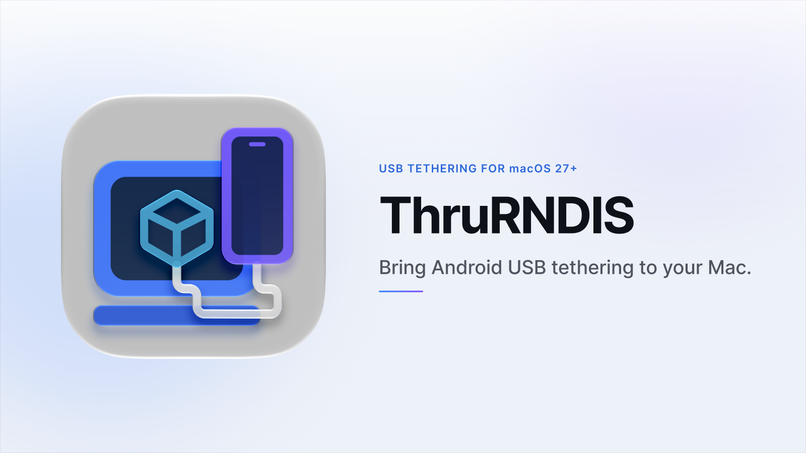
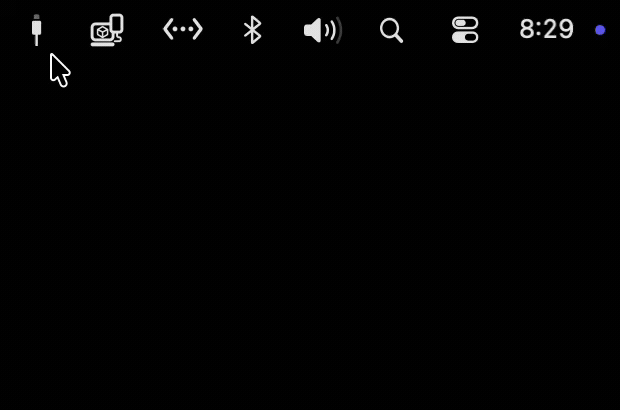

# ThruRNDIS: USB Tethering via VM USB Passthrough

[English](./README.md) | [한국어](./README.ko.md)


<picture>
  <source media="(prefers-color-scheme: dark)" srcset="./images/introduction-dark.png">
  <source media="(prefers-color-scheme: light)" srcset="./images/introduction-light.png">
  
</picture>

## 소개

ThruRNDIS는 macOS에서 안드로이드의 RNDIS 방식 USB 테더링을 사용할 수 있게 해 주는 Virtualization Framework 기반 Swift 앱입니다.

## 요구 사항

- macOS 27 beta 2 이상
- RNDIS 방식 USB 테더링을 지원하는 장치(예: 안드로이드 기기)
- 첫 실행 시 VM Assets를 내려받기 위한 인터넷 연결

## 설치 방법

### GitHub Releases

[최신 ThruRNDIS 릴리스](https://github.com/Afcoo/ThruRNDIS/releases/latest)

### Homebrew

```sh
brew install --cask afcoo/tap/thrurndis
```

## 사용 방법

1. **VM Assets 설치:** 온보딩 또는 설정에서 최신 VM Assets를 설치합니다.
2. **USB 장치 전달:** 메뉴 막대의 **가상 머신 액세서리**에서 USB 장치를 **ThruRNDIS**로 전달합니다.

   

3. **USB 기기 연결 확인:** USB 기기 연결 팝업에서 연결을 승인합니다.
4. **WireGuard 연결 확인:** WireGuard 연결 팝업에서 연결을 승인합니다.

## 작동 원리

```text
ThruRNDIS WireGuard Network System Extension
-> VZNAT guest endpoint UDP/<ListenPort>
-> Linux VM wg0
-> nftables masquerade
-> Linux VM usb0
-> RNDIS USB tethering device
```

*참조: [`Virtualization Framework: VZUSBPassthroughDevice`](https://developer.apple.com/documentation/virtualization/vzusbpassthroughdevice)*

ThruRNDIS는 경량 Linux VM을 실행하고 macOS에 연결된 RNDIS 장치를 USB passthrough로 VM에 전달합니다.

macOS와 VM은 VZNAT을 통해 WireGuard 터널로 연결되며, VM은 WireGuard를 통해 전달된 macOS의 트래픽을 인식된 RNDIS 장치에 전달합니다.

ThruRNDIS는 VZNAT을 통한 WireGuard 터널 연결을 위해 [`변형된 wireguard-apple 포크`](https://github.com/Afcoo/wireguard-apple/tree/thrurndis-vznat-bind)를 사용합니다.

## 라이선스

ThruRNDIS 소스 코드는 [MIT License](./LICENSE.txt)에 따라 배포됩니다.
